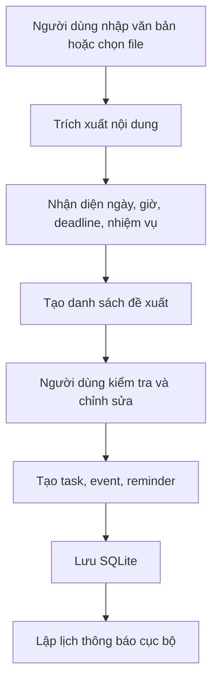

# SmartTime Planner iOS – Tài liệu yêu cầu và workflow triển khai

## 1. Mục tiêu dự án

**SmartTime Planner iOS** là ứng dụng quản lý thời gian cá nhân chạy trên iPhone, tập trung vào các nhu cầu: tạo lịch, đặt lời nhắc, báo thức học tập/làm việc, quản lý nhiệm vụ, ghi chú và nhập file nội dung để tự gợi ý lịch. Ứng dụng được thiết kế theo định hướng **offline-first**, tức là dữ liệu chính được lưu trực tiếp trên điện thoại bằng SQLite, sau đó có thể mở rộng đồng bộ iCloud hoặc server ở các phiên bản sau.

Mục tiêu phiên bản đầu tiên không phải là xây dựng một hệ thống AI phức tạp, mà là tạo ra một ứng dụng iOS có thể cài trên iPhone thật, sử dụng được hằng ngày và có cấu trúc mã nguồn đủ tốt để mở rộng thành app thông minh.

---

## 2. Lựa chọn công nghệ đề xuất

### 2.1. Hướng công nghệ chính

Đối với yêu cầu chỉ ưu tiên hệ điều hành iOS, nên chọn hướng phát triển **native iOS**:

| Thành phần | Công nghệ đề xuất | Vai trò |
|---|---|---|
| Ngôn ngữ lập trình | Swift | Xây dựng logic ứng dụng iOS |
| Giao diện | SwiftUI | Thiết kế giao diện hiện đại, khai báo, dễ mở rộng |
| IDE | Xcode | Viết code, chạy simulator, cài app lên iPhone |
| Kiến trúc | MVVM | Tách giao diện, xử lý nghiệp vụ và dữ liệu |
| Cơ sở dữ liệu cục bộ | SQLite | Lưu nhiệm vụ, lịch, ghi chú, file nhập vào và lời nhắc |
| Thông báo | UserNotifications | Đặt thông báo cục bộ và lời nhắc theo thời gian |
| Nhập file | Document Picker + PDFKit | Chọn file từ điện thoại và trích xuất nội dung PDF cơ bản |
| OCR ảnh | Vision Framework | Đọc chữ từ ảnh ở phiên bản nâng cao |
| Quản lý mã nguồn | Git + GitHub | Theo dõi phiên bản và quản lý tiến độ |

### 2.2. Lý do chọn SwiftUI thay vì React Native hoặc Flutter

SwiftUI phù hợp nhất trong trường hợp ứng dụng chỉ cần chạy tốt trên iOS. Các lý do chính gồm:

1. SwiftUI là công nghệ gốc của hệ sinh thái Apple, có khả năng tích hợp tốt với thông báo, file, lịch, widget và quyền hệ thống.
2. Xcode cho phép chạy thử trên iOS Simulator và cài trực tiếp lên iPhone thật.
3. Ứng dụng native thường có mức độ ổn định tốt hơn khi xử lý thông báo cục bộ, file nội bộ và các API riêng của iOS.
4. Dự án dễ mở rộng sang Apple Watch, iPad hoặc macOS nếu cần.

Nếu sau này muốn phát triển cả Android, có thể cân nhắc React Native hoặc Flutter. Tuy nhiên, với mục tiêu hiện tại là app iOS cá nhân, SwiftUI là lựa chọn hợp lý hơn.

---

## 3. Phần mềm cần cài đặt

### 3.1. Bắt buộc

1. **macOS**: cần máy Mac để phát triển iOS app bằng Xcode.
2. **Xcode**: cài từ Mac App Store.
3. **iPhone cá nhân**: dùng để chạy thử app trên thiết bị thật.
4. **Apple Account**: dùng để đăng nhập trong Xcode và ký ứng dụng khi chạy thử.
5. **Git**: quản lý mã nguồn.
6. **GitHub Desktop hoặc SourceTree**: tùy chọn, giúp quản lý Git dễ hơn nếu chưa quen dòng lệnh.

### 3.2. Khuyến nghị

1. **DB Browser for SQLite** hoặc **SQLiteStudio**: xem và kiểm tra file cơ sở dữ liệu SQLite.
2. **Visual Studio Code**: chỉnh sửa Markdown, SQL và tài liệu dự án.
3. **Figma**: thiết kế giao diện trước khi code.
4. **Notion/Trello/GitHub Projects**: quản lý tiến độ các chức năng.

---

## 4. Phạm vi chức năng theo phiên bản

### 4.1. Phiên bản MVP – có thể dùng thật trên iPhone

Phiên bản MVP cần hoàn thành các chức năng tối thiểu sau:

| Mã | Chức năng | Mức ưu tiên | Mô tả |
|---|---|---:|---|
| F01 | Tạo nhiệm vụ | P0 | Người dùng tạo việc cần làm với tiêu đề, mô tả, hạn hoàn thành và mức ưu tiên |
| F02 | Quản lý lịch | P0 | Người dùng tạo sự kiện với thời gian bắt đầu, kết thúc, địa điểm và ghi chú |
| F03 | Lời nhắc | P0 | Người dùng đặt thông báo trước thời điểm diễn ra sự kiện hoặc deadline |
| F04 | Báo thức học tập/làm việc | P0 | Người dùng tạo báo thức dạng nhắc mạnh cho các mốc quan trọng |
| F05 | Ghi chú | P0 | Người dùng tạo ghi chú độc lập hoặc gắn ghi chú với nhiệm vụ/sự kiện |
| F06 | Danh mục | P0 | Phân loại theo học tập, công việc, cá nhân, dự án, môn học |
| F07 | Trang chủ hôm nay | P0 | Hiển thị nhiệm vụ, sự kiện, deadline và nhắc việc trong ngày |
| F08 | Lưu dữ liệu offline | P0 | Toàn bộ dữ liệu được lưu trong SQLite trên thiết bị |

### 4.2. Phiên bản 2 – nhập nội dung và tự gợi ý lịch

| Mã | Chức năng | Mức ưu tiên | Mô tả |
|---|---|---:|---|
| F09 | Nhập văn bản thủ công | P1 | Người dùng dán nội dung thông báo, đề bài hoặc lịch học vào app |
| F10 | Nhập file PDF/TXT | P1 | Người dùng chọn file từ iPhone để app trích xuất nội dung |
| F11 | Nhận diện ngày giờ | P1 | App nhận diện các mẫu ngày, giờ, hạn nộp và thời gian sự kiện |
| F12 | Sinh đề xuất nhiệm vụ | P1 | App tạo danh sách nhiệm vụ/lịch đề xuất từ nội dung đầu vào |
| F13 | Xác nhận trước khi lưu | P1 | Người dùng kiểm tra và sửa trước khi app tạo lịch chính thức |

### 4.3. Phiên bản 3 – trợ lý lập kế hoạch thông minh

| Mã | Chức năng | Mức ưu tiên | Mô tả |
|---|---|---:|---|
| F14 | Tự chia nhỏ nhiệm vụ | P2 | App chia nhiệm vụ lớn thành các bước nhỏ theo thời gian còn lại |
| F15 | Gợi ý lịch tối ưu | P2 | App đề xuất thời điểm làm việc dựa trên độ ưu tiên và thời gian trống |
| F16 | Thống kê năng suất | P2 | App thống kê số nhiệm vụ hoàn thành, số giờ tập trung và deadline trễ |
| F17 | OCR ảnh thông báo | P2 | App đọc chữ từ ảnh chụp thông báo hoặc bảng lịch |
| F18 | Đồng bộ iCloud/server | P2 | Dữ liệu có thể đồng bộ giữa nhiều thiết bị |

---

## 5. Màn hình giao diện cần xây dựng

Ứng dụng nên có 7 màn hình chính:

| STT | Màn hình | Nội dung chính |
|---:|---|---|
| 1 | HomeView | Tổng quan hôm nay, deadline gần nhất, nút thêm nhanh |
| 2 | CalendarView | Lịch ngày/tuần/tháng, danh sách sự kiện |
| 3 | TaskView | Danh sách nhiệm vụ, lọc theo trạng thái và độ ưu tiên |
| 4 | NoteView | Ghi chú theo danh mục, môn học hoặc dự án |
| 5 | ImportView | Nhập văn bản/file và sinh lịch gợi ý |
| 6 | FocusView | Pomodoro, báo thức học tập/làm việc, phiên tập trung |
| 7 | SettingsView | Cài đặt thông báo, âm báo, định dạng thời gian, sao lưu dữ liệu |

---

## 6. Kiến trúc mã nguồn đề xuất

Dự án nên tổ chức theo kiến trúc **MVVM + Service + Repository**.

```text
SmartTimePlanner/
├── App/
│   ├── SmartTimePlannerApp.swift
│   └── AppRouter.swift
├── Models/
│   ├── TaskItem.swift
│   ├── CalendarEvent.swift
│   ├── ReminderItem.swift
│   ├── NoteItem.swift
│   ├── Category.swift
│   └── ImportedFile.swift
├── Views/
│   ├── Home/
│   ├── Calendar/
│   ├── Tasks/
│   ├── Notes/
│   ├── Import/
│   ├── Focus/
│   └── Settings/
├── ViewModels/
│   ├── HomeViewModel.swift
│   ├── TaskViewModel.swift
│   ├── CalendarViewModel.swift
│   ├── NoteViewModel.swift
│   └── ImportViewModel.swift
├── Services/
│   ├── NotificationService.swift
│   ├── FileImportService.swift
│   ├── TextExtractionService.swift
│   ├── ScheduleSuggestionService.swift
│   └── AlarmService.swift
├── Database/
│   ├── DatabaseManager.swift
│   ├── TaskRepository.swift
│   ├── EventRepository.swift
│   ├── ReminderRepository.swift
│   ├── NoteRepository.swift
│   └── schema.sql
├── Resources/
│   ├── Assets.xcassets
│   └── Sounds/
└── Tests/
    ├── SmartTimePlannerTests/
    └── SmartTimePlannerUITests/
```

---

## 7. Workflow phát triển dự án

### 7.1. Giai đoạn 1 – Khởi tạo dự án

1. Mở Xcode.
2. Chọn **Create a new Xcode Project**.
3. Chọn **iOS > App**.
4. Đặt tên dự án: `SmartTimePlanner`.
5. Interface chọn **SwiftUI**.
6. Language chọn **Swift**.
7. Tạo Git repository ngay khi khởi tạo dự án.

### 7.2. Giai đoạn 2 – Thiết lập cấu trúc thư mục

1. Tạo các thư mục: `Models`, `Views`, `ViewModels`, `Services`, `Database`, `Resources`.
2. Thêm file `schema.sql` vào thư mục `Database`.
3. Tạo class `DatabaseManager.swift` để mở database SQLite.
4. Tạo các model dữ liệu tương ứng với bảng trong SQL.

### 7.3. Giai đoạn 3 – Làm cơ sở dữ liệu

1. Thiết kế bảng dữ liệu trong SQLite.
2. Tạo bảng `tasks`, `events`, `reminders`, `notes`, `categories`, `imported_files`.
3. Viết repository cho từng nhóm dữ liệu.
4. Kiểm tra CRUD: thêm, sửa, xóa, đọc dữ liệu.

### 7.4. Giai đoạn 4 – Làm giao diện MVP

Thứ tự màn hình nên triển khai:

1. `HomeView`: tổng quan hôm nay.
2. `TaskView`: thêm/sửa/xóa nhiệm vụ.
3. `CalendarView`: thêm/sửa/xóa sự kiện.
4. `NoteView`: thêm/sửa/xóa ghi chú.
5. `SettingsView`: cấu hình thông báo.

### 7.5. Giai đoạn 5 – Tích hợp thông báo và báo thức

1. Tạo `NotificationService.swift`.
2. Xin quyền gửi thông báo từ người dùng.
3. Tạo hàm lập lịch thông báo theo thời gian cụ thể.
4. Gắn thông báo với bảng `reminders`.
5. Kiểm tra trên iOS Simulator và iPhone thật.

### 7.6. Giai đoạn 6 – Nhập nội dung và sinh lịch

1. Tạo `ImportView`.
2. Cho phép người dùng dán văn bản vào app.
3. Viết hàm nhận diện ngày giờ bằng rule-based parser.
4. Sinh danh sách `extracted_items`.
5. Hiển thị danh sách gợi ý để người dùng xác nhận.
6. Khi người dùng bấm xác nhận, tạo `tasks`, `events`, `reminders` tương ứng.

### 7.7. Giai đoạn 7 – Cài app lên iPhone thật

1. Kết nối iPhone với Mac bằng cáp hoặc Wi-Fi debugging.
2. Mở Xcode, chọn thiết bị iPhone thật ở thanh chọn thiết bị.
3. Vào **Signing & Capabilities**.
4. Chọn Apple Account cá nhân trong mục Team.
5. Bấm Run để build và cài app lên iPhone.
6. Trên iPhone, cấp quyền tin cậy nhà phát triển nếu hệ thống yêu cầu.
7. Kiểm tra các chức năng: thêm lịch, thêm nhiệm vụ, thông báo, báo thức, ghi chú.

---

## 8. Workflow Git đề xuất

### 8.1. Nhánh mã nguồn

```text
main       : phiên bản ổn định
feature/*  : nhánh phát triển chức năng mới
fix/*      : nhánh sửa lỗi
release/*  : nhánh chuẩn bị bản chạy thử
```

### 8.2. Quy tắc commit

```text
feat: thêm chức năng mới
fix: sửa lỗi
refactor: chỉnh cấu trúc code
style: chỉnh giao diện hoặc format
chore: cập nhật cấu hình, thư viện, tài liệu
docs: cập nhật tài liệu
```

Ví dụ:

```bash
git checkout -b feature/task-management
git add .
git commit -m "feat: add task management screen"
git push origin feature/task-management
```

---

## 9. Quy trình xử lý file đầu vào

### 9.1. Luồng nghiệp vụ



### 9.2. Nguyên tắc nhận diện nội dung ban đầu

Ở phiên bản đầu, không cần AI phức tạp. Có thể dùng quy tắc nhận diện theo mẫu:

| Mẫu nội dung | Cách xử lý |
|---|---|
| `nộp trước ngày ...` | Tạo deadline |
| `hạn nộp ...` | Tạo task có due date |
| `lúc 8h ngày ...` | Tạo event |
| `họp nhóm ...` | Tạo event hoặc task |
| `chuẩn bị báo cáo ...` | Tạo task |
| `thuyết trình ...` | Tạo event + reminder |

---

## 10. Yêu cầu phi chức năng

| Nhóm yêu cầu | Nội dung |
|---|---|
| Hiệu năng | Màn hình chính mở dưới 2 giây với dữ liệu cục bộ |
| Offline | Tạo, sửa, xóa nhiệm vụ và ghi chú không cần Internet |
| Dễ dùng | Thêm nhiệm vụ mới trong tối đa 3 thao tác chính |
| An toàn dữ liệu | Dữ liệu lưu cục bộ; chưa gửi ra server ở MVP |
| Mở rộng | Có thể bổ sung AI parser hoặc đồng bộ cloud về sau |
| Kiểm thử | Có unit test cho parser ngày giờ, repository và notification service |

---

## 11. Roadmap triển khai

### Tuần 1 – Khởi tạo và giao diện cơ bản

- Tạo project SwiftUI.
- Tạo cấu trúc thư mục.
- Thiết kế model dữ liệu.
- Tạo giao diện Home, Task, Note cơ bản.

### Tuần 2 – SQLite và CRUD

- Tạo database SQLite.
- Viết repository.
- Làm thêm/sửa/xóa nhiệm vụ.
- Làm thêm/sửa/xóa ghi chú.

### Tuần 3 – Lịch và nhắc việc

- Làm CalendarView.
- Tạo Event.
- Tạo Reminder.
- Tích hợp UserNotifications.

### Tuần 4 – Nhập nội dung và sinh lịch gợi ý

- Làm ImportView.
- Trích xuất nội dung từ text.
- Nhận diện deadline bằng rule-based parser.
- Tạo extracted items.
- Cho người dùng xác nhận và lưu.

### Tuần 5 – Kiểm thử trên iPhone thật

- Cài app lên iPhone.
- Kiểm thử thông báo.
- Kiểm thử dữ liệu offline.
- Sửa lỗi giao diện và luồng sử dụng.

---

## 12. Tiêu chí hoàn thành MVP

MVP được xem là đạt yêu cầu khi ứng dụng có thể:

1. Chạy được trên iPhone thật.
2. Tạo được nhiệm vụ có deadline.
3. Tạo được sự kiện trong lịch.
4. Tạo được thông báo nhắc việc.
5. Tạo được ghi chú.
6. Lưu dữ liệu bằng SQLite.
7. Hiển thị danh sách việc hôm nay.
8. Nhập văn bản và sinh ít nhất một đề xuất nhiệm vụ hoặc deadline.
9. Người dùng xác nhận đề xuất trước khi tạo lịch chính thức.
10. Không phụ thuộc Internet cho các chức năng cơ bản.

---

## 13. Hướng mở rộng sau MVP

Sau khi MVP hoạt động ổn định, có thể mở rộng các chức năng sau:

1. Widget ngoài màn hình chính iPhone.
2. Đồng bộ iCloud.
3. Tự động chia nhỏ nhiệm vụ lớn.
4. OCR ảnh thông báo bằng Vision Framework.
5. Tích hợp Calendar của iOS bằng EventKit.
6. Tạo báo cáo năng suất theo tuần.
7. Tích hợp AI API để phân tích file phức tạp.
8. Xuất dữ liệu ra CSV hoặc PDF.
9. Sao lưu và khôi phục database.
10. Chế độ học tập Pomodoro nâng cao.

---

## 14. Kết luận kỹ thuật

Đối với mục tiêu xây dựng app quản lý thời gian cài trực tiếp trên iPhone cá nhân, lựa chọn phù hợp nhất là **Swift + SwiftUI + Xcode + SQLite + UserNotifications**. Cách tiếp cận này giúp dự án khai thác tốt hệ sinh thái iOS, giảm phụ thuộc vào server và bảo đảm app có thể hoạt động offline. Trong giai đoạn đầu, chức năng tự sinh lịch nên triển khai bằng các quy tắc nhận diện ngày giờ đơn giản; sau khi ứng dụng ổn định, có thể bổ sung AI để phân tích file phức tạp hơn.
